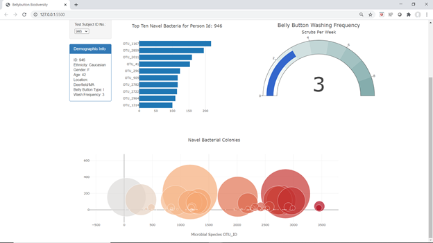

# biodiversity-challenge
Please use the following URL to view a working webpage for this challenge.

    https://carleeyoung.github.io/biodiversity-challenge/

In this challenge, results from a belly button microbial characterization study were charted using Plot.ly, JavaScript, and html code to visualize data for each indivual in the study.  The first visualization is a horizontal bar chart displaying the species identified by the operational taxonomic units (OTU_ID), and the number of colony forming units found of each species.  The guage chart displays the belly button scrubbing frequency reported by the indivual.  The bubble chart represents the magnitude of growth for each microbial species reflected by the size of each bubble.

